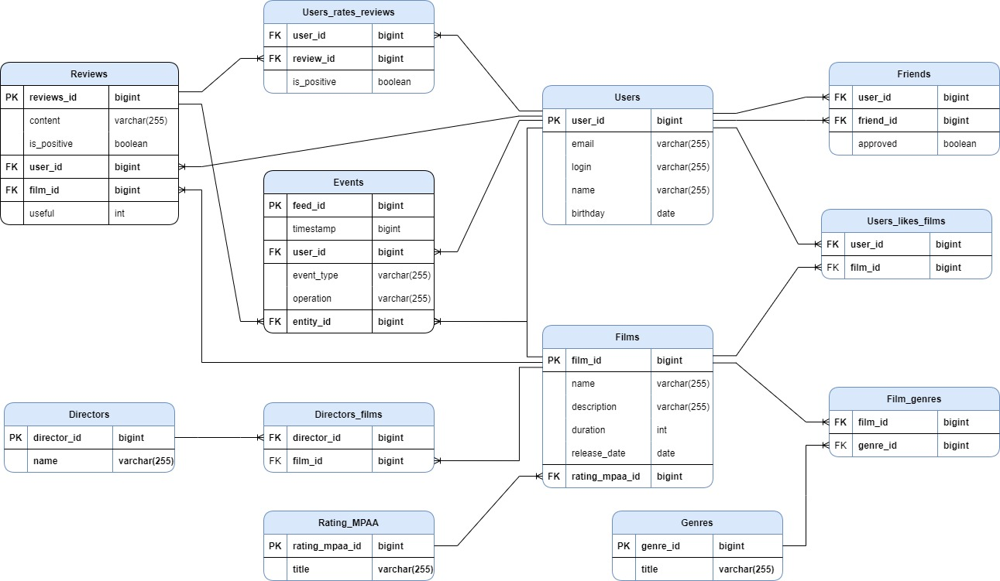

# Repository Filmorate project

## Quick start
### Requirements

- Java Platform (JDK) 11
- Apache Maven 4.x

While in the directory on the command line, type:

`mvn package`

`java -jar target/filmorate-0.0.1-SNAPSHOT.jar`

## Rest service layer

- (GET) http://localhost:8080/films (get list of all films)
- (POST) http://localhost:8080/films (post create new film sending json info)
- (PUT) http://localhost:8080/films/{id} (update existing film sending json info with specified id)
- (GET) http://localhost:8080/films/{id} (get film with specified id)
- (DELETE) http://localhost:8080/films/{id} (delete film with specified id)
- (PUT) http://localhost:8080/films/{id}/like/{userId} (updates an existing movie, adds 1 like to it from the user)
- (DELETE) http://localhost:8080/films/{id}/like/{userId} (removes 1 like from the user from the movie)
- (GET) http://localhost:8080/films/popular (get list popular films)
- (GET) http://localhost:8080/users (get list of all users)
- (POST) http://localhost:8080/users (post create new user sending json info)
- (PUT) http://localhost:8080/users/{id} (update existing user sending json info with specified id)
- (GET) http://localhost:8080/users/{id} (get user with specified id)
- (DELETE) http://localhost:8080/users/{id} (delete user with specified id)
- (PUT) http://localhost:8080/users/{id}/friends/{friendId} (updates an existing user, adds friend)
- (DELETE) http://localhost:8080/users/{id}/friends/{friendId} (updates an existing user, removes friend)
- (GET) http://localhost:8080/users/{id}/friends (get all the user's friends)
- (GET) http://localhost:8080/users/{id}/friends/{otherId} (get all mutual friends of users)

## Database dependency diagram

